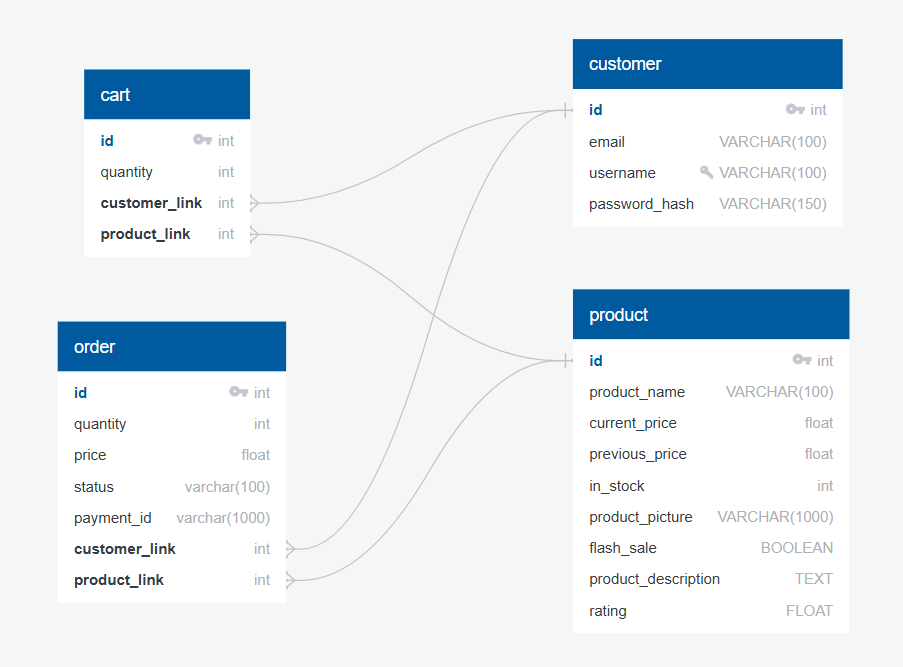

# Project 1 - E-commerce Website project 
## Introduction
This project is a learning exercise focused on developing an e-commerce website. It simulates key features of a modern online shopping platform, such as product catalogs, a shopping cart, user account management, and a checkout system. The project emphasizes practical experience in front-end design, back-end integration, and database management.

Through this initiative, valuable insights were gained into building responsive and user-friendly web applications. Key aspects of the project include planning, design, implementation, and lessons learned. This repository serves as a showcase of applied web development concepts and best practices.
## Project structure 
```
ecommerce-website/
├── database/
│   ├── carts.csv
│   ├── customers.csv
│   ├── orders.csv
│   ├── products.csv

├── instance/
│   ├── ecommerce.sqlite3

├── website/
│   ├── static/
│   │   ├── css/
│   │   ├── images/
│   │   ├── js/
│   ├── templates/
        ├── ...

│   ├── __init__.py
│   ├── auth.py
│   ├── forms.py
│   ├── import_to_sql.py
│   ├── models.py
│   ├── views.py

├── app.py
```

## Database
My database has 4 tables: Cart, Customer, Order, Product. Here is the relational diagram:


## Requirements
- Python version 3.11 or higher

## Installation
Clone the repository, change the current working directory to this repository's root folder:

```
git clone https://github.com/fisherman611/E-commerce-website.git
```
```
cd E-commerce-website
```

Install ```requirements.txt``` (replace `3.11` with your installed Python version):

    ```
    py -3.11 -m pip install -r requirements.txt
    ```

## Demo
To run the application using the command line, use the following command (replace `3.11` with your installed Python version):
```
py -3.11 -m app.py
```

## References and tools
[1] HTML Codex. URL [https://htmlcodex.com/]

[2] Font Awesome. URL [https://fontawesome.com/]

[3] Owl Carousel 2. URL [https://owlcarousel2.github.io/OwlCarousel2/]

[4] Boostrap Theming. URL [https://github.com/twbs/bootstrap/blob/main/]

[5] QuickDBD. URL [https://www.quickdatabasediagrams.com/]

[6] Frost-Codes, Flask Ecommerce repository. URL[https://github.com/Frost-Codes/Flask-Ecommerce]

## Contributing
Contributions are welcome! If you find any issues or have suggestions for improvements, please open an issue or submit a pull request.

## License 
This project is licensed under the [MIT License](https://mit-license.org/). 